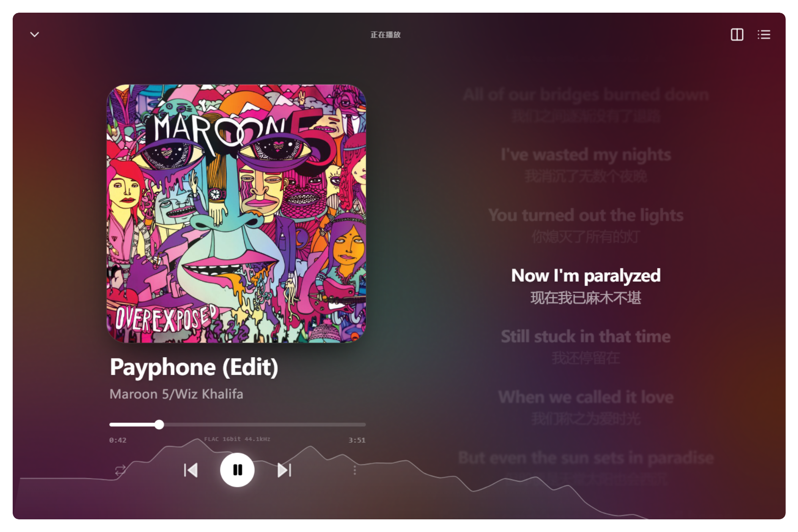
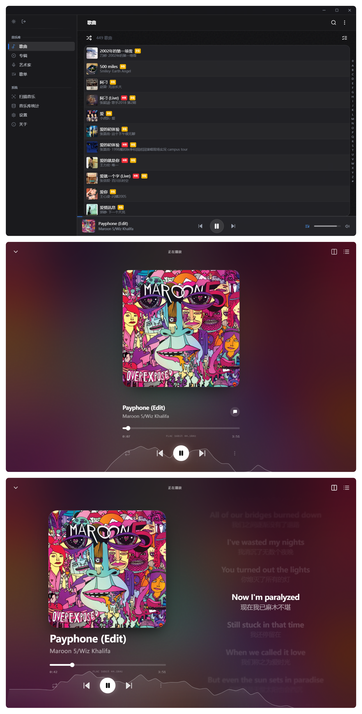
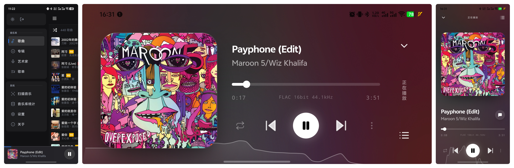

<div align="center">

<h1>八音 (BaYin)</h1>
<p>一款基于 Tauri + React 的跨平台音乐播放器，采用 macOS 风格设计</p>

[发行版](https://github.com/CallmeLins/BaYin/releases) | [问题反馈](https://github.com/CallmeLins/BaYin/issues)

<br /><br />


</div>

<br />



## 技术栈

- **桌面框架**: [Tauri 2](https://tauri.app/) (Rust)
- **前端框架**: React 18 + TypeScript
- **构建工具**: Vite
- **UI 组件**: Radix UI + Tailwind CSS 4
- **动画**: Framer Motion
- **状态管理**: React Context
- **路由**: React Router
- **音频引擎**: Rust 原生 (symphonia + cpal + rustfft + rubato)

## 功能特性

- 🎵 支持多种音频格式 (MP3, FLAC, WAV, AAC, M4A, OGG, AIFF, OPUS)
- 🔊 Rust 原生音频引擎，跨平台统一（Windows / macOS / Linux / Android）
- 🎛️ 10 段参数化均衡器（Biquad IIR 滤波器，多种预设）
- 📊 实时音频频谱可视化（底部波浪动效，FFT 驱动）
- 🥁 封面低音脉冲动效
- 🎤 LRC 歌词解析与同步滚动，支持双语翻译
- ✨ 逐字卡拉OK歌词（支持内联时间标签，60fps 平滑高亮）
- 👆 歌词点击跳转播放
- 📝 播放队列管理（添加、移除、清空）
- 🔄 多种播放模式（顺序、随机、单曲循环）
- 🔊 音量控制与静音
- 📂 本地文件夹扫描与增量更新
- 📁 文件变动实时监听（桌面端）
- 💿 歌曲、专辑、艺术家分类浏览
- 🏷️ 音质标签显示 (HR: Hi-Res, SQ: 无损)
- 📋 歌单创建与管理
- 🌐 流媒体服务器集成（Navidrome、Jellyfin、Emby、Subsonic、OpenSubsonic）
- 🖥️ 系统托盘支持（桌面端）
- 🌙 深色/浅色主题切换
- 📱 响应式布局（支持桌面和移动端）
- ✨ macOS 风格毛玻璃效果

## 界面展示

### 桌面端


### 移动端


## 获取

### 二进制安装

可以在 [Releases](https://github.com/CallmeLins/BaYin/releases) 中获取最新版本

### 本地开发

#### 前置要求

- [Node.js](https://nodejs.org/) >= 18
- [Rust](https://www.rust-lang.org/tools/install)
- [Tauri 依赖](https://tauri.app/start/prerequisites/)

#### 安装依赖

```bash
# 克隆仓库（包含子模块）
git clone --recursive https://github.com/CallmeLins/BaYin.git

# 或者克隆后初始化子模块
git submodule update --init --recursive

# 安装前端依赖
cd src-ui
npm install
cd ..
```

#### 运行开发环境

```bash
npx tauri dev
```

#### 构建生产版本

```bash
npx tauri build
```

## 联系我

### TG群组

[https://t.me/+sQPyUqlcYaY5OTI9](https://t.me/+sQPyUqlcYaY5OTI9)

## 支持项目

如果觉得本项目对你有帮助，欢迎 Star 支持！

<div align="center" style="margin: 20px 0;">


</div>

## 许可证

本项目基于 [Apache License 2.0](LICENSE) 许可进行开源

## Star History

[](https://star-history.com/#CallmeLins/BaYin&Date)
